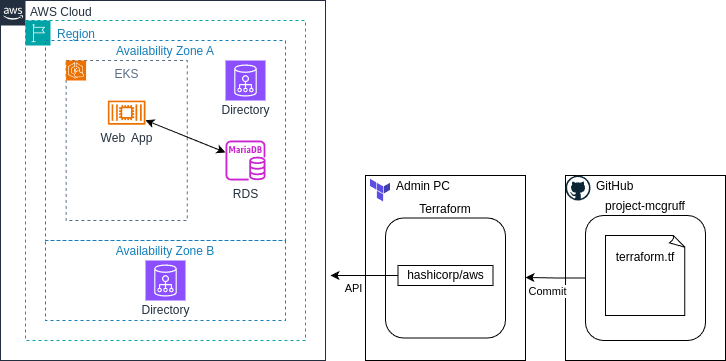

# CiscoDevNet/project-mcgruff

## Overview

Reference cloud application deployment incorporating various Cisco security technology APIs.  Focuses on common real-world components and patterns, applying security best practices.



## Application

A 'typical' containerized, client-server web application with internal REST API and access group use-cases for at least 3 classes of users (admin/employee/external-customer).

### Components

#### Application

* [AWS EKS](https://aws.amazon.com/eks/) (Kubernetes) - single pod/node/cluster.

* [Wordpress container](https://hub.docker.com/_/wordpress) as the sample web application.

* [AWS Relational Database Services (RDS)](https://aws.amazon.com/rds/) hosting MariaDB.

#### Network Infrastructure

* [AWS Directory Services](https://aws.amazon.com/directoryservice/) providing Microsoft Active Directory.

* [AWS Virtual Private Cloud](https://aws.amazon.com/vpc/) for egress/ingress and standard network services (DNS).

* [AWS Cloud Compute](https://aws.amazon.com/ec2/) providing instance hosting EKS pods.

Also using: AWS [IAM](https://aws.amazon.com/iam/) / [ACM](https://aws.amazon.com/certificate-manager/) / [Route 53](https://aws.amazon.com/route53/)

#### Security Products

* [Cisco Duo Single-Sign-On/Multi-factor Authentication](https://duo.com/)

* (Others TBD)

## Pre-Requisites

* **Amazon AWS admin account** - this must be a paid account.  Note: this project will create AWS resources that will incur (modest) ongoing charges - be sure to perform the steps in [Cleanup AWS Resources](#cleanup-aws-resources)

* [AWS CLI](https://docs.aws.amazon.com/cli/latest/userguide/getting-started-install.html) installation - assumes login credentials have been obtained and CLI commands can be executed against the target AWS account/region.

* [Kubectl](https://kubernetes.io/docs/tasks/tools/) installation.

* [Helm](https://helm.sh/docs/intro/install/) installation.


## Getting Started


## Cleanup AWS Resources


## Notes

* Get kubectl config file for EKS cluster:

  ```
  aws eks update-kubeconfig --region us-east-1 --name CLUSTERNAME
  ```

* **View Deployment logs**:

  ```
  kubectl -n namespace get pods
  kubectl -n namespace logs deployment-bbfd776f5-cs4fj
  ```

* **Restart deployment**:

  ```
  kubectl rolling restart deployment deployment-bbfd776f5-cs4fj
  ```

* **Container Interactive Terminal Session**:

  ```
  kubectl -n namespace exec -it deployment-bbfd776f5-cs4fj -- /bin/bash
  ```

## Estimated apply times

| Config             | File          | Time  |
| ------------------ | ------------- | ----- |
| aws_infrastructure |               |       |
|                    | vpc.tf        |  0:26 |
|                    | cluster.tf    | 10:52 |
|                    | directory.tf  | 30:00 |
| k8s_application    |               |  0:22 |
|                    | database.tf   |  5:22 |
|                    | deployment.tf |  0:22 |